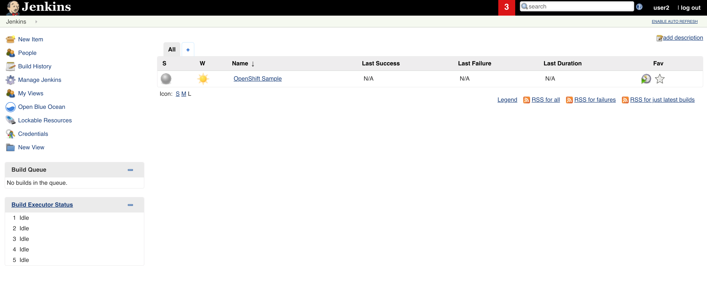
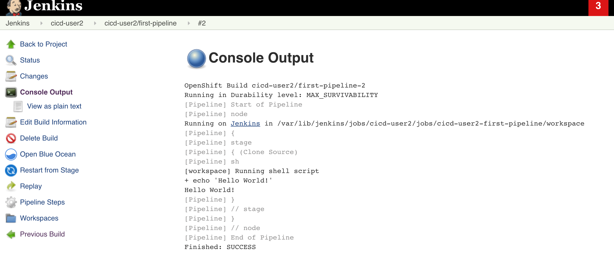

# Pipelines and Jenkins on OpenShift

OpenShift comes with a Jenkins image that is opiniated and preconfigured to allow jobs to be scheduled on the Kubernetes cluster. Moreover, the following features all together create a very good user experience when using Jenkins together with OpenShift:

- Jenkins is configured for OAuth2 based Authentication and Authorization towards Openshift
- Jenkins can schedule slave pods with different build tools on demand
- Builds with *Pipeline* strategy are executed by Jenkins without any interaction on Jenkins, one console to rule them all
- Objects such as ConfigMaps and Secrets from OpenShift are sycned/copied into Jenkins

## CI/CD Principles in a nutshell
When dealing with containers in a CI/CD settings the following principles are very important:

- Container images should be built once and only once. If you have to build different images per stage, something went wrong :(
- For configuring stage dependant things such as database credentials & coordinates, MQ related settings and general application configuration, use environment values, configuration files that are populated via ConfigMaps and/or Secrets.
- Container images should be tagged so that matching software/code is visible
- Changes from one stage to the next, should be applied via automation and without any manual intervention. Changes should be reproducible and traceable.

## Pipelines

One of the primary build strategies that come with the OpenShift Container Platform is called the **Pipeline**.

The Pipeline build strategy can be used to implement sophisticated workflows:
- continuous integration
- continuous deployment

The Pipeline build strategy allows developers to define a [Jenkins pipeline](https://jenkins.io/doc/pipeline/) for execution by the Jenkins pipeline plugin. The build can be started, monitored, and managed by OpenShift Container Platform in the same way as any other build type.

Pipeline workflows are defined in a Jenkinsfile, either embedded directly in the pipeline configuration, or supplied in a Git repository and referenced by the pipeline configuration.

## First pipeline

You should have access to a project called **cicd-userXY**  , switch to this project via:

```bash
oc project cicd-userXY
```

**UserXY** will have admin rights on project **cicd-userXY**

In this project, there should be a route with name jenkins. Let's see what routes exist in the project:

```bash
[root@bastion ~]# oc get routes
NAME      HOST/PORT                                                   PATH      SERVICES   PORT      TERMINATION     WILDCARD
jenkins   jenkins-cicd-userXY.apps.zurich-fdbf.openshiftworkshop.com             jenkins    <all>     edge/Redirect   None
```

Now copy the url from this route, in this case *jenkins-cicd-userXY.apps.zurich-fdbf.openshiftworkshop.com* from the route definition and open this url in a browser. **!Replace the route url with what you get from your own execution**

The first time you hit a OpenShift Jenkins with a specific user, you might get a Jenkins screen asking for authorization permissions.
See the image below.


Accept these and go to the next screen, by clicking on 'Alow selected permissions'.

Next screen, should be the famous/classical (or infamous) Jenkins welcome screen.




### Step 1
Now that we have confirmed Jenkins master is up and running, we can start creating a first pipeline. Openshift pipelines are just BuildConfig objects with a special stragety.

Copy the content below and write it into a file called **bc_first-pipeline.yaml**

```
apiVersion: v1
kind: BuildConfig
metadata:
  name: first-pipeline
spec:
  strategy:
    jenkinsPipelineStrategy:
      jenkinsfile: |-
        pipeline {
          stages {
            stage("Hello") {
              steps {
               sh 'echo "Hello World!"'
              }
            }
          }
        }
    type: JenkinsPipeline
  triggers: []
```

**Note**: The pipeline above is a declarative Jenkins pipeline. For seeing the differences between declarative vs scripting see [here](https://jenkins.io/doc/book/pipeline/syntax/#compare)

and let's create a resource based on this file on the cicd project.
```
oc create -f bc_first-pipeline.yaml -n cicd-userXY
```

**Note*** command above creates the pipeline in CICD project. If the pipeline would be created in DEV stage then the cluster would try to provision a Jenkins master instance in the DEV stage. In the current step, a jenkins master should already be provisioned in the CICD project.

As soon as the pipeline is created, we can start it with the following command:
```
oc start-build first-pipeline -n cicd-userXY
```

Now go to OpenShift web console and go to pipelines view by clicking on Builds>Pipelines from the menu shown on left, see the image below:


You should see that first run/build of the pipeline has failed:


Now click on the 'View Log' link, to jump to Jenkins build logs. See the image below which highlights the 'View Log' link.
 

In this screen we have an error message which says 'agent section' is missing.

 

Agent is a reuired field for a declarative pipeline, you can read [here](https://jenkins.io/doc/book/pipeline/syntax/#agent) for details.

Let's add the following section to our pipeline to set an agent.

```
  agent {
    label 'master'
  }
```

whole pipeline would look like this:

```
pipeline {
  agent {
    label 'master'
  }
  stages {
    stage("Clone Source") {
      steps {
       sh 'echo "Hello World!"'
      }
    }
  }
}
```

This means, we would like pipeline steps to be executed in the master. After updating the pipeline, run the pipeline again. This time it should finish successfully. See the image below for example output from a successful run:


 

It's up to the Jenkins author to decide where each step of a Pipeline should be executed. Depending on what tools are used, you should select the right agent. For example, if you want to run a maven task, then maven should be available on the target agent where the maven step is executed.

### Step 2
Let's continue to extend our pipeline.

This time, we would like to checkout some source code and create a deployable artifact.
We will update the existing pipeline ( **first-pipeline** ) with the following pipeline definition.

```
pipeline {
  agent {
    label 'maven'
  }
  stages {
    stage("Clone Source") {
      steps {
       git 'https://github.com/mcelep/spring-boot-hello-world.git'
      }
    }
    
    stage("Mvn build"){
        steps{
            sh "mvn clean package -DskipTests"
        }
    }
  }
}
```

There are couple of things to notice here:
- As target agent instead of **master** , **maven** is used. This will cause a new pod to be scheduled, if there is no existing one.
- All the steps are executed on the agent that is specified at the pipeline level.
- There are two steps now. The first one is for checking out the source code. The second step, spawns a new shell to trigger maven goals.
  
Run the pipeline again. Either via oc cli ( oc start-build) or OpenShift Web Console or alternatively directly via the Jenkins UI. You will notice that Jenkins and Openshift will be consistent regarding Job definitions and status i.e. you can also start a Jenkins Job via the 'Build Now' button on Jenkins and the job run should syncrhonized a build back to OpenShift.

The cli command for starting a new build:
```
oc start-build first-pipeline
```

In order to see the creation of the new maven pod/slave/agent, the following command can be used:
```
oc get pods -w
```

example output:
```
NAME              READY     STATUS    RESTARTS   AGE
jenkins-1-dqzmg   1/1       Running   0          4h
maven-v8j2m   0/1       Pending   0         0s
maven-v8j2m   0/1       Pending   0         0s
maven-v8j2m   0/1       ContainerCreating   0         0s
maven-v8j2m   1/1       Running   0         5s
maven-v8j2m   0/1       Terminating   0         1m
maven-v8j2m   0/1       Terminating   0         1m
maven-v8j2m   0/1       Terminating   0         1m
```

**Note:** After build was complete the newly created maven pod (*maven-v8j2m* in the example above) got terminated.
The behavior of how long a slave/agent pod stays around is controlled via Jenkins. Click on 'Manage Jenkins' on main Jenkins Screen, go to 'Configure System' search for 'Time in minutes to retain slave when idle', enter a value for this field if you want to keep slaves around even when they are not in use.


Check the build job logs again. This time you should see from the logs that maven ran and it downloaded pretty much the whole internet :) 
Example logs tail:
```
[INFO] Installing /tmp/workspace/cicd-user2/cicd-user2-first-pipeline/target/spring-boot-hello-world-0.1.0.jar to /home/jenkins/.m2/repository/com/appuio/techlab/spring-boot-hello-world/0.1.0/spring-boot-hello-world-0.1.0.jar
[INFO] Installing /tmp/workspace/cicd-user2/cicd-user2-first-pipeline/pom.xml to /home/jenkins/.m2/repository/com/appuio/techlab/spring-boot-hello-world/0.1.0/spring-boot-hello-world-0.1.0.pom
[INFO] ------------------------------------------------------------------------
[INFO] BUILD SUCCESS
[INFO] ------------------------------------------------------------------------
[INFO] Total time: 57.224 s
[INFO] Finished at: 2019-04-18T11:44:16Z
[INFO] Final Memory: 34M/146M
[INFO] ------------------------------------------------------------------------
[Pipeline] }
[Pipeline] // stage
[Pipeline] }
[Pipeline] // node
[Pipeline] End of Pipeline
Finished: SUCCESS
```

A jar artifact is ready to be used within a container.


**Note** For increasing build speed, more memory/cpu can be provided to slave pod.

**Note** To persist (and thus to avoid download) dependencies through different job runs, see [Slaves with PVs](#Slaves-with-PVs)

### Step 3

We have 4 OpenShift projects for each user:
- cicd-userXY : Jenkins and slaves
- app-dev-userXY: Stage development
- app-int-userXY: Stage integration
- app-prod-userXY: Stage production


Now that there is an artifact, namely a jar file that we would like to run, we need to create a container image from this jar file. A docker build with binary input seems appropriate for the job. We should build a container image in the **DEV** stage. So Use the following commands to create a bc, dc, service and route:

```
oc project app-dev-userXY
oc new-build java --name=spring-app   --binary=true
oc new-app spring-app --allow-missing-imagestream-tags
oc patch dc/spring-app -p '{"spec":{"triggers":[]}}'
oc patch dc spring-app --type=json  -p '[{"op": "replace", "path": "/spec/template/spec/containers/0/readinessProbe", "value": { "failureThreshold": 3, "httpGet": { "path": "/pod", "port": 8080, "scheme": "HTTP" }, "initialDelaySeconds": 10, "periodSeconds": 10, "successThreshold": 1, "timeoutSeconds": 30 }}]'
oc create service clusterip spring-app --tcp=8080:8080
oc expose svc/spring-app
```

After having prepared the application on Dev stage, pipeline can be updated with the following content:
```
pipeline {
  agent {
    label 'maven'
  }
  
  environment {
    app = "spring-app"
    devProject = 'app-dev-user2'
  }
  
  stages {
    stage("Clone Source") {
      steps {
       git 'https://github.com/mcelep/example-spring-boot-helloworld'
      }
    }
    
    stage("Mvn build"){
        steps{
            sh "mvn clean install -DskipTests"
            sh "mv target/*.jar target/artifact.jar"
        }
    }
    
    stage('Build image on Openshift') {
      steps {
        script {
          openshift.withProject("${devProject}") {
            println "Building latest on bc:${app} on project:${devProject}"
            openshift.selector("bc", app).startBuild("--from-file=target/artifact.jar", "--wait")
          }
        }
      }
    }
  }
}
```

Start the pipeline again and see that it fails with a message like:
```
ERROR: Error running start-build on at least one item: [buildconfig/spring-app];
{reference={}, err=Uploading file "target/artifact.jar" as binary input for the build ...

Uploading finished
Error from server (Forbidden): buildconfigs.build.openshift.io "spring-app" is forbidden: User "system:serviceaccount:cicd-userXY:jenkins" cannot create buildconfigs.build.openshift.io/instantiatebinary in the namespace "app-dev-userXY": no RBAC policy matched, verb=start-build, cmd=oc --server=https://172.30.0.1:443 --certificate-authority=/var/run/secrets/kubernetes.io/serviceaccount/ca.crt --namespace=app-dev-userXY --token=XXXXX start-build buildconfig/spring-app --from-file=target/artifact.jar --wait -o=name , out=, status=1}

Finished: FAILURE
```

The reason for this failure is that, CICD project service account which jenkins slave runs with does not have the right permissions on the target project i.e. DEV in this case. Assign the correct rights by using `oc policy add-role-to-user` command. See [Openshift rights](Openshift-rights) section for details. *Edit* role should suffice for enabling Jenkins in this particular case.
Example command:
```
oc policy add-role-to-user edit system:serviceaccount:cicd-userXY:jenkins -n app-dev-userXY
```

Run the build again and this time build should succeed. The new build should also trigger a new deployment. Verify that the latest deployment has run succesfully and there is a pod running for the application.


### Step 4

Next step is to tag the image that was just built but before that let's trigger a new deployment and add a simple to test to verify that software works as expected.

Embed the *step* below into the pipeline to add a simple testing mechanism. A simple curl call is made and its HTTP return status code is checked after having a deployed the latest version of the app.
Add code shown below to the end of pipeline.

```
stage('Functional tests') {
            steps {
                script {
                    openshift.withProject("${devProject}") {
                        openshift.selector("dc", app).rollout().latest()
                        def latestDeploymentVersion = openshift.selector('dc',app).object().status.latestVersion
                        def rc = openshift.selector('rc', "${app}-${latestDeploymentVersion}")
                        timeout (time: 2, unit: 'MINUTES') {
                            rc.untilEach(1){
                                def rcMap = it.object()
                                return (rcMap.status.replicas.equals(rcMap.status.readyReplicas))
                            }
                        }
                        def route= sh( script:'oc get route '+app+' -ocustom-columns=host:{.spec.host} --no-headers -n' +devProject ,returnStdout: true)
                        println("Calling route:${route}")
                        def httpCode = sh(script:'curl -s -o /dev/null -w "%{http_code}" ' + route,returnStdout: true)
                        if(httpCode!="200"){
                            throw new Exception("Curl failed, HttpStatus:${httpCode}")
                        }                        
                    }
                }
            }
        }
```

Container image is tested and ready to be tagged.
There will be two tags added to the image. One is based on the version derived from the pom and Jenkins Build Job number. The other one is based short git hash.
Add code shown below to the end of pipeline.

First, add a function to the end of the pipeline(after closing curly brackets).
```
def getVersionFromPom(pom) {
  def matcher = readFile(pom) =~ '<version>(.+)</version>'
  def version= matcher ? matcher[0][1] : null
  if(version.endsWith('.RELEASE')){
    version = version.substring(0,version.lastIndexOf('.'))
  }
  return version
}
```

Add a new stage for tagging with code below:

```
    stage('Tag image'){
        steps{
            script{
                
                version=getVersionFromPom('pom.xml')+"${BUILD_NUMBER}" // BUILD_NUMBER variable comes from Jenkins Job
                def gitHash= sh(script:'git rev-parse --short HEAD' ,returnStdout: true)
                
                openshift.withProject(devProject) {
                    openshift.tag("${app}:latest", "${app}:${version}")
                    openshift.tag("${app}:latest", "${app}:${gitHash}")
                }
            }
        }
    }
```

### Step 5: Templates

Now that Dev stage is ready and  OpenShift objects for next stange can be created.

The template which is saved in a file called *labs/data/pipelines/template_spring-app.yml* can be used for importing OpenShift objects that make up the application in other projects/namespaces. OpenShift templating is a simple yet powerful abstraction. To learn more about it, see [here](https://docs.openshift.com/container-platform/3.11/dev_guide/templates.html) and [here](openshift_templates.md) . For general templating options see [here](templating.md).

One important thing to notice here is that, BuildConfig is not included in the template. Reason for that is, our goal is to use the same container image that is already built. That means, integration and production stages need to pull container image from development stage. Commands below assign the correct rights for int and prod stages on dev stage:

```

oc policy add-role-to-user system:image-puller system:serviceaccount:app-prod-userXY:default --namespace=app-dev-userXY

oc policy add-role-to-user system:image-puller system:serviceaccount:app-int-userXY:default --namespace=app-dev-userXY
```

With the following command, Openshift objects required for the application can be created on both INT and PROD stages:

```
for ns in 'app-int-userXY' 'app-prod-userXY';do oc process -f labs/data/pipelines/template_spring-app.yml | oc apply -f - -n "$ns";done
```

### Step 6

It's time to deploy to non-DEV stages. Create a new pipeline by clicking on 'New Item' on the main Jenkins screen. In this new screen, select the 'Pipeline' type and create a pipeline based on the code below.

By the way, you might run into couple of issues when running this new pipeline. Using what you've learned in the previous steps, you should be able to solve them.

```
def app = 'spring-app'
def devProject = 'app-dev-userXY'
def intProject = 'app-int-userXY'
def prodProject = 'app-prod-userXY'
def project = ''
def imageTag = ''

properties([
        parameters([
                choice(choices: "integration\nproduction", description: 'Stage, which will be checked out.', name: 'STAGE'),
		string(name: 'TAG', defaultValue: '', description: 'Image tag to use for deployment')

        ])
])

switch ("${params.STAGE}") {
    case "integration":
        project = intProject
        break

    case "production":
        project = prodProject
        break

    default:
        project = ''
}

if (project == '') {
    currentBuild.result = 'ABORTED'
    error('No valid project selected ...')
}

imageTag = params.TAG

if(!imageTag){
    currentBuild.result = 'ABORTED'
    error('No tag entered...')
}

pipeline {
    agent {
        label 'master'
    }

    stages {
        stage('Change image stream') {
            steps {
                script {
                        openshift.withProject(project) {
                            latestDeploy = openshift.selector('dc', app).object()
                            latestDeploy.spec.template.spec.containers[0].image="docker-registry.default.svc:5000/${devProject}/${app}:${imageTag}"
                            openshift.apply(latestDeploy)
                        }
                }
            }
        }

        stage('Deploy image') {
            steps {
                script {
                        openshift.withProject(project) {
                            openshift.selector("dc", app).rollout().latest()
                            timeout(3) {
                                def latestDeploymentVersion = openshift.selector('dc', app).object().status.latestVersion
                                def rc = openshift.selector('rc', "${app}-${latestDeploymentVersion}")
                                rc.untilEach(1) {
                                    def rcMap = it.object()
                                    return (rcMap.status.replicas.equals(rcMap.status.readyReplicas))
                                }
                            }
                        }
                }
            }
        }
    }
}
```

If you create a pipeline on OpenShift, it will automatically get synced with Jenkins back. When a pipeline is created directly on Jenkins however, it will not appear under OpenShift pipelines automatically.

### Step X

Now that you know the basic knowhow about using Jenkins on OpenShift you might want to tackle more complex scenarios.
#### A/B deployments:

The A/B deployment strategy lets you try a new version of the application in a limited way in the production environment. You can specify that the production version gets most of the user requests while a limited fraction of requests go to the new version. Since you control the portion of requests to each version, as testing progresses you can increase the fraction of requests to the new version and ultimately stop using the previous version.  See [here](https://docs.openshift.com/container-platform/3.11/dev_guide/deployments/advanced_deployment_strategies.html#advanced-deployment-a-b-deployment) for more details.


In a nutshell: Have 2 deploymentconfigs which use different versions of container images and have 2 services each of which points to a specific deploymentconfig. Read [this link](https://docs.openshift.com/container-platform/3.11/architecture/networking/routes.html#alternateBackends) to see how you can loadbalance incoming traffic to diffferent services.

#### Blue / Green deployments

Martin Fowler defines Blue/Green deployments so:
>One of the challenges with automating deployment is the cut-over itself, taking software from the final stage of testing to live production. You usually need to do this quickly in order to minimize downtime. The blue-green deployment approach does this by ensuring you have two production environments, as identical as possible. At any time one of them, let's say blue for the example, is live. As you prepare a new release of your software you do your final stage of testing in the green environment. Once the software is working in the green environment, you switch the router so that all incoming requests go to the green environment - the blue one is now idle. 

Thanks to abstractions offered, blue/green deployments are pretty straightforward on OpenShift.
See [here](https://docs.openshift.com/container-platform/3.11/dev_guide/deployments/advanced_deployment_strategies.html#advanced-deployment-strategies-blue-green-deployments) for OpenShift's take on it.

And [here](https://github.com/mcelep/ocp-adv-app-dev/blob/master/dev/Jenkinsfile) is an example blue/green pipeline.

Go ahead and see if you can implement a pipeline for blue/greed deployment yourself.

## General tips and tricks

### Slaves with PVs

Jenkins slaves which run as Pods are by default stateless i.e. if there are artifacts or other binaries that you would like to keep even when a Pod gets restarted, Persistent Volumes should be used. Make sure that artifact folder used by maven is on the persistent volume. To force maven to use a specific folder,  you can configure mvn on the fly via: ``` mvn -Dmaven.repo.local=$HOME/.my/other/repository clean install ``` or via  the *setting.xml* file.

### Slave retention/idle time

 Jenkins slave that are created on demand will be terminated after they are done building jobs and sometimes you want to keep slaves around even when they are not doing any work so that you don't need to wait until a slave is created and registered on Jenkins master. 
 The retention policy and  setting ***Time in minutes to retain agent when idle*** which is listed under 'Kubernetes Pod Template', can be used to control how long you keep unused/idle slaves around.

 
### OpenShift Jenkins Sync

[Openshift-jenkins-sync-plugin](https://github.com/openshift/jenkins-sync-plugin/blob/master/README.md) can sync objects such as Secrets,ConfigMaps from OpenShift projects onto Jenkins. This is a very powerful feature and it's also the main enabler of pipeline strategy builds. One typical use case is to keep credentials such git ssh keys as secrets and have Jenkins sync them so that these credentials can be used in build jobs.

For syncing secrets make sure that secrets are labeled accordingly. E.g. :```  oc label secret jboss-eap-quickstarts-github-key credential.sync.jenkins.openshift.io=true```


### OpenShift Client Plugins

Jenkins slaves/masters can run on one cluster and they can interact with other clusters. See [jenkins-client-plugin](https://github.com/openshift/jenkins-client-plugin) for details.
In order to address multiple clusters, first configure them on Jenkins via *Manage Jenkins-> Configure Systems->OpenShift Jenkins Sync* as shown in image below.


Using the declarative pipeline, specific clusters can be targeted using `openshift.withCluster` notation.

### Openshift rights

All pods on OpenShift run with a ServiceAccount and the service account that 'runs' a job should have the rights set up according to what actions it aims to execute on the target namespace/project.

```
oc policy add-role-to-user edit system:serviceaccount:$CICD_PROJECT:$SA -n $TARGET_PROJECT


$CICD_PROJECT is the OpenShift project on which Jenkins job runs.
$SA sets the service account which runs the Jenkins job.
$TARGET_PROJECT is where OpenShift object you interact with resides on.
```
